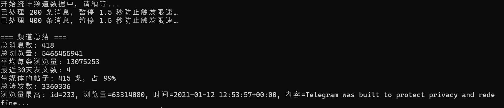

# Resumen de Canales de Telegram

> Recopila rápidamente las métricas clave de cualquier canal de Telegram utilizando la API para desarrolladores y Telethon.

## Introducción

Resumen de Canales de Telegram es un script en Python que aprovecha Telethon para obtener el número de suscriptores, historiales de mensajes y otros datos esenciales del canal. El resultado ofrece una visión general concisa que te ayuda a evaluar el rendimiento de un canal en segundos.

## Cómo empezar

### 1. Instala las dependencias

Asegúrate de tener Python instalado y luego instala Telethon:

```bash
pip install telethon
```

### 2. Configura las credenciales de desarrollador

1. Abre el [portal de desarrolladores de Telegram](https://my.telegram.org/apps).
2. Crea una aplicación para obtener tu `api_id` y `api_hash`.
3. Actualiza los valores de `api_id` y `api_hash` en `tg.py` con tus credenciales.

### 3. Configura los parámetros del canal

- Define la variable `channel` en `tg.py` con el nombre de usuario del canal que quieres analizar.
- Ajusta `BATCH_SIZE` según sea necesario; para canales con más de 1.000 mensajes, incrementa el valor para respetar los límites de velocidad de Telegram.

### 4. Ejecuta el script

Inicia el script con:

```bash
python tg_es.py
```

En la primera ejecución, sigue las indicaciones para introducir tu número de teléfono (incluido el código de país, por ejemplo `+13333333333`). Telegram te enviará un código de verificación: introdúcelo cuando se te pida y espera a que se genere el resumen.

## Ejemplo de salida



---

Otros idiomas:

- [中文 README](README.md)
- [English README](README_EN.md)
- [Русский README](README_RU.md)
